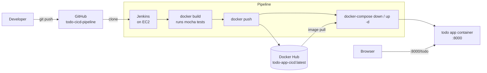

# ToDo CI/CD Pipeline

A Node.js (Express + EJS) to-do app with a Jenkins pipeline that builds a Docker image, pushes it to Docker Hub and redeploys it with Docker Compose on an AWS EC2 host.

## Architecture



## Stack

| Layer | Tech |
|---|---|
| App | Node.js, Express 4, EJS, `sanitizer` for HTML escaping |
| Tests | Mocha, Chai |
| Packaging | Docker (`node:24.21.0-alpine`), Docker Compose |
| CD | Jenkins declarative pipeline, Docker Hub |
| Hosting | AWS EC2 |
| Checks | GitHub Actions: hadolint, image build + smoke test, Trivy |

## Quick start

```bash
git clone https://github.com/frenzyali/todo-cicd-pipeline.git
cd todo-cicd-pipeline

# Run the published image
docker compose up -d

# or build locally (this also runs the tests)
docker build -t todo-app-cicd .
docker run -d -p 8000:8000 todo-app-cicd
```

Open http://localhost:8000/todo (or `http://<ec2-public-ip>:8000/todo`, with port 8000 open in the security group).

## Jenkins setup

1. Install Jenkins with Docker and `docker-compose` available to the Jenkins user.
2. Add a "Username with password" credential with ID `docker-hub` (your Docker Hub user and an access token).
3. Create a Pipeline job from SCM pointing at this repo; `Jenkinsfile` defines the stages: clone, build, push to Docker Hub, deploy.
4. Optional: add a GitHub webhook to the Jenkins job so pushes trigger a build. This is configured in Jenkins and GitHub, not in the `Jenkinsfile`.

Update the `docker-compose.yaml` image name and the repo URL in the `Jenkinsfile` if you fork this.

## Design decisions

- **Tests gate the image.** `npm run test` is a Dockerfile step, so an image that fails its tests never gets built, let alone pushed.
- **Credentials stay in Jenkins.** The Docker Hub login uses `withCredentials` and `--password-stdin`, so the token never appears in the repo, the command line or the process list.
- **Compose for deploys.** `docker-compose down && up -d` is the simplest way to roll a single container on one host; the trade-off is a short outage per deploy.
- **Separate CI on GitHub Actions.** It builds and smoke-tests the image and scans it with hadolint and Trivy on every push and PR, independent of the Jenkins host.
- **Trivy is report-only.** Findings are surfaced without blocking the build.

## Known limitations

- `test.js` only asserts arithmetic; it does not exercise the app's routes. The pipeline's test gate is therefore weak.
- Items are stored in memory, so they are lost whenever the container restarts.
- `docker-compose.yaml` still has the obsolete `version:` key, which newer Compose versions ignore with a warning.

## Cleanup

```bash
docker compose down            # stop and remove the container
docker rmi alihussain312008/todo-app-cicd:latest todo-app-cicd
```

Then delete the Jenkins job and the `docker-hub` credential, remove the image from Docker Hub, and stop or terminate the EC2 instance if it was created for this project.
